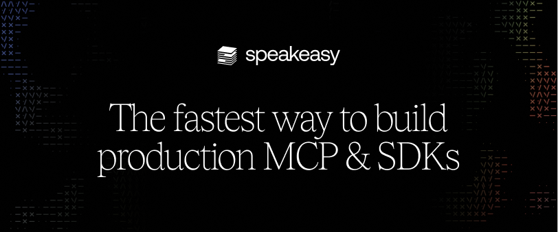

# openapi-typescript

Tools for consuming OpenAPI schemas in TypeScript.

## 📦 Packages

<a href="./packages/openapi-typescript"> 
Generate TypeScript types from static OpenAPI schemas
</a>

<a href="./packages/openapi-fetch"> 
Ultra-fast fetching for TypeScript generated automatically from your OpenAPI schema.
</a>

## ⭐ Sponsors

### 🥇 Gold Sponsors

  
  

### 🥈 Silver Sponsors

### Backers

  
  
  
  

Become a sponsor by supporting this project on [OpenCollective](https://opencollective.com/openapi-ts)!

## 🤝 Contributing

Contributions are appreciated and welcome! See the appropriate guide for each package:

- [Contributing to openapi-typescript](./packages/openapi-typescript/CONTRIBUTING.md)
- [Contributing to openapi-fetch](./packages/openapi-fetch/CONTRIBUTING.md)
- [Contributing to docs](./docs/CONTRIBUTING.md)

## ♥️ Thanks

- Thanks to [the Project Sponsors](#-sponsors) for keeping this project going!
- Thanks to [dozens of lovely, smart contributors](https://github.com/openapi-ts/openapi-typescript/graphs/contributors) that made this library possible
- Thanks to [Vitepress](https://vitepress.dev/) for the docs site
- Thanks to [Cloudflare Pages](https://pages.cloudflare.com/) for docs site hosting
- Thanks to [Algolia](https://www.algolia.com/) for the docs site search

## 🌐 Web Resources & Interactive Index
- [CUBE TO HOLE PUZZLE](https://studyplaying.github.io/cube-to-hole-puzzle.html)
- [CATEGORY SHOOTER 2](https://ilearnworldkr.pages.dev/category-shooter-2.html)
- [DOOMSDAY SURVIVAL RPG SHOOTER](https://studyquests.github.io/doomsday-survival-rpg-shooter.html)
- [CATEGORY OBSTACLE299](https://studyquests.pages.dev/category-obstacle299.html)
- [HELP ME TRICKY BRAIN PUZZLES](https://iskillquest.pages.dev/help-me-tricky-brain-puzzles.html)
- [CRAFT MAN VS GIANT TNT](https://quizverses.github.io/craft-man-vs-giant-tnt.html)
- [CATEGORY DEFENSE176](https://studyquesthub.web.app/category-defense176.html)
- [HERO RABBIT IDLE SURVIVOR RPG](https://thelearnquesters.pages.dev/hero-rabbit-idle-survivor-rpg.html)
- [ITALIAN BRAINROT SURVIVAL ARENA](https://themindzone.pages.dev/italian-brainrot-survival-arena.html)
- [SNEAKY FRIENDS](https://studyquests.github.io/sneaky-friends.html)
- [CATEGORY CASUAL 8](https://thequizzone.pages.dev/category-casual-8.html)
- [CATEGORY RUNNING107](https://thelearnquester.web.app/category-running107.html)
- [ANGRY CITY SMASHER](https://thelearnquesters.pages.dev/angry-city-smasher.html)
- [METEOHEROES](https://thelearnquesters.pages.dev/meteoheroes.html)
- [NUMBER DOMINATION](https://thelearnquesters.pages.dev/number-domination.html)
- [CATEGORY PHYSICS371](https://studyquesthub.web.app/category-physics371.html)
- [CRAB GUARDS](https://thequizzone.pages.dev/crab-guards.html)
- [BLOCK DODGER](https://thequizzone.pages.dev/block-dodger.html)
- [BOOM STICK BAZOOKA](https://thequizzone.pages.dev/boom-stick-bazooka.html)
- [FASHION WEEK 2025](https://thequizzone.pages.dev/fashion-week-2025.html)
- [MY FARM EMPIRE](https://studyplaying.github.io/my-farm-empire.html)
- [CATEGORY MATCH 3 2](https://thequizzone.pages.dev/category-match-3-2.html)
- [ROCKET FEST](https://thelearnquester.web.app/rocket-fest.html)
- [HAPPY BROTHERS](https://thelearnquesters.pages.dev/happy-brothers.html)
- [GEOMETRY DASH JUMP](https://learnquester.github.io/geometry-dash-jump.html)
- [ROBOTS GONE WILD](https://quizverses-9d2f2.web.app/robots-gone-wild.html)
- [BRAINSTORMING 2D](https://thelearnquesters.pages.dev/brainstorming-2d.html)
- [CATEGORY SPORTS](https://studyplayings.pages.dev/category-sports.html)
- [SHARK CHOMP CHASE](https://studyquests.github.io/shark-chomp-chase.html)
- [SUPERMARKET SHOPPING FOR KIDS](https://studyplaying.github.io/supermarket-shopping-for-kids.html)
- [TRIANGLE WAY](https://thequizzone.pages.dev/triangle-way.html)
- [CATEGORY TOWER DEFENSE 2](https://learnquester.pages.dev/category-tower-defense-2.html)
- [CATEGORY MAHJONG CONNECT](https://thequizzone.pages.dev/category-mahjong-connect.html)
- [STACK UP](https://thequizzone.pages.dev/stack-up.html)
- [CATEGORY CAR](https://studyquesthub.web.app/category-car.html)
- [MAHJONG TILE CLUB](https://quizverses.pages.dev/mahjong-tile-club.html)
- [STEAL BRAINROT EGGS](https://thelearnquesters.pages.dev/steal-brainrot-eggs.html)
- [RACE IT CAR RACING](https://studyquests.github.io/race-it-car-racing.html)
- [HAIR SALON BEAUTY SALON](https://thequizzone.pages.dev/hair-salon-beauty-salon.html)
- [OFFICE SOLITAIRE](https://studyquests.github.io/office-solitaire.html)
- [QUIZ 10 SECONDS MATH](https://thequizzone.pages.dev/quiz-10-seconds-math.html)
- [CATEGORY CAN T STOP PLAYING215](https://studyquesthub.web.app/category-can-t-stop-playing215.html)
- [CATEGORY SPACE57](https://thelearnquester.web.app/category-space57.html)
- [STICKMAN DISMOUNT SIMULATOR](https://thequizzone.pages.dev/stickman-dismount-simulator.html)
- [CATEGORY PUZZLE](https://quizverses.pages.dev/category-puzzle.html)
- [PRESS A TO PARTY](https://thelearnquesters.pages.dev/press-a-to-party.html)
- [DELIVERY CHAOS](https://thequizzone.pages.dev/delivery-chaos.html)
- [FOOTBALL HEADS 2025](https://studyplaying.github.io/football-heads-2025.html)
- [BATTLE OF TANK STEEL](https://thelearnquesters.pages.dev/battle-of-tank-steel.html)
- [MOTO ATTACK BIKE RACING](https://thelearnquesters.pages.dev/moto-attack-bike-racing.html)
- [CHICKEN SHOOTER IO](https://studyquests.github.io/chicken-shooter-io.html)
- [PHONE CASE DIY 5](https://thelearnquesters.pages.dev/phone-case-diy-5.html)
- [CATEGORY STRATEGY](https://thequizzone.pages.dev/category-strategy.html)
- [ORGANIZE IT](https://thelearnquester.web.app/organize-it.html)
- [DONUT RUN](https://thequizzone.pages.dev/donut-run.html)
- [PRINCESSES AT HORROR SCHOOL](https://studyplaying.github.io/princesses-at-horror-school.html)
- [CATEGORY MOUSE1 707](https://studyquesthub.web.app/category-mouse1-707.html)
- [CHAOS ROAD COMBAT CAR RACING](https://quizverses-9d2f2.web.app/chaos-road-combat-car-racing.html)
- [HYDRAULIC PRESS 2D ASMR](https://studyquests.github.io/hydraulic-press-2d-asmr.html)
- [BRAINROT ICE TRUCK](https://thelearnquesters.pages.dev/brainrot-ice-truck.html)
- [CATEGORY PUZZLE 3](https://thelearnquester.web.app/category-puzzle-3.html)
- [CATEGORY MAHJONG 2](https://thequizzone.pages.dev/category-mahjong-2.html)
- [SNOW RACE 3D FUN RACING](https://thelearnquester.web.app/snow-race-3d-fun-racing.html)
- [INDEX39](https://thequizzone.pages.dev/index39.html)
- [ROBOT TERMINATOR T REX](https://thequizzone.pages.dev/robot-terminator-t-rex.html)
- [GROW A GARDEN FOR BRAINROTS](https://thelearnquester.web.app/grow-a-garden-for-brainrots.html)
- [GRASS LAND](https://studyquests.github.io/grass-land.html)
- [FASHION DYE PRO](https://thequizzone.pages.dev/fashion-dye-pro.html)
- [CATEGORY DRESS UP](https://studyquesthub.web.app/category-dress-up.html)
- [CATEGORY CONTROLLER](https://quizverses-9d2f2.web.app/category-controller.html)
- [ANIMATION COLORING ALPHABET LORE](https://thelearnquesters.pages.dev/animation-coloring-alphabet-lore.html)
- [MUKI WIZARD](https://quizverses-9d2f2.web.app/muki-wizard.html)
- [ESCAPE ANCIENT EGYPT](https://thequizzone.pages.dev/escape-ancient-egypt.html)
- [PUZZLE LINES AND KNOTS 1](https://quizverses-9d2f2.web.app/puzzle-lines-and-knots-1.html)
- [SCHOOLBOY RUNAWAY ROOM ESCAPE](https://quizverses.github.io/schoolboy-runaway-room-escape.html)
- [COLOR BLOCK JAM 2](https://thelearnquesters.pages.dev/color-block-jam-2.html)
- [OBBY PARKOUR RACING](https://thelearnquesters.pages.dev/obby-parkour-racing.html)
- [SKIBIDI TOILET VS CAMERAMAN SNIPER GAME](https://thelearnquesters.pages.dev/skibidi-toilet-vs-cameraman-sniper-game.html)
- [PET RUNNER](https://studyquests.github.io/pet-runner.html)
- [MAIDO](https://studyplayings.pages.dev/maido.html)
- [CATEGORY COLLECT565](https://thelearnquester.web.app/category-collect565.html)
- [MAJESTIC DRAGONS MERGE](https://learnquester.github.io/majestic-dragons-merge.html)
- [CATEGORY MANAGEMENT](https://studyplayings.pages.dev/category-management.html)
- [HOLE EAT GROW ATTACK](https://studyplaying.github.io/hole-eat-grow-attack.html)
- [INDEX31](https://thequizzone.pages.dev/index31.html)
- [DARK MYTH MONKEY MERGE](https://learnquester.github.io/dark-myth-monkey-merge.html)
- [BUNNY BOY ONLINE](https://thelearnquesters.pages.dev/bunny-boy-online.html)
- [IDLE INVENTOR](https://thequizzone.pages.dev/idle-inventor.html)
- [STICKMAN ROGUE ONLINE](https://studyplaying.github.io/stickman-rogue-online.html)
- [EMOJI SMASHER SMILEY GAME](https://learnquester.github.io/emoji-smasher-smiley-game.html)
- [BOSS MARKET](https://studyplaying.github.io/boss-market.html)
- [CATEGORY THIRD PERSON SHOOTER80](https://studyplayings.web.app/category-third-person-shooter80.html)
- [CATEGORY PUZZLE 6](https://studyquesthub.web.app/category-puzzle-6.html)
- [VISUAL MEMORY DRAG DROP](https://thequizzone.pages.dev/visual-memory-drag-drop.html)
- [CATEGORY MATCH 3117](https://learnquester.pages.dev/category-match-3117.html)
- [CATEGORY POOL](https://thequizzone.pages.dev/category-pool.html)
- [CATEGORY JUMP SCARE21](https://thelearnquesters.pages.dev/category-jump-scare21.html)
- [MUSHROOM FEVER MATCH 3](https://thequizzone.pages.dev/mushroom-fever-match-3.html)
- [MINE FPS SHOOTER NOOB ARENA](https://thequizzone.pages.dev/mine-fps-shooter-noob-arena.html)
- [OBBY CHAMPIONS](https://thequizzone.pages.dev/obby-champions.html)
- [MERGE IN SPACE](https://studyquesthub.web.app/merge-in-space.html)
- [WORM OUT BRAIN TEASER GAMES](https://thequizzone.pages.dev/worm-out-brain-teaser-games.html)
- [MOJICON SPRING CONNECT](https://studyquests.github.io/mojicon-spring-connect.html)
- [CATEGORY MERGE 2](https://themindzone.pages.dev/category-merge-2.html)
- [COIN MERGE MACHINE](https://studyquests.github.io/coin-merge-machine.html)
- [CATEGORY RESTAURANT64](https://themindplay.github.io/category-restaurant64.html)
- [SWEET HAUNT 2](https://thequizzone.pages.dev/sweet-haunt-2.html)
- [ISLAND EXPANDER](https://iskillquest.pages.dev/island-expander.html)
- [MAGIC BUBBLES](https://studyquesthub.web.app/magic-bubbles.html)
- [CATEGORY ADVENTURE 2](https://studyquests.pages.dev/category-adventure-2.html)
- [CATEGORY DEFENSE176](https://themindplay.pages.dev/category-defense176.html)
- [EARWAX CLINIC](https://studyplayings.pages.dev/earwax-clinic.html)
- [BURGER EMPIRE](https://iskillquest.pages.dev/burger-empire.html)
- [ITALIAN ANIMAL ALCHEMY BRAINROT](https://thelearnquesters.pages.dev/italian-animal-alchemy-brainrot.html)
- [SUDOKU GURU CLASSIC SUDOKU](https://thelearnquesters.pages.dev/sudoku-guru-classic-sudoku.html)
- [MONSTER MERGE LEGENDS ALIVE](https://iskillquest.pages.dev/monster-merge-legends-alive.html)
- [BEST FRIENDS PUZZLE](https://studyplaying.github.io/best-friends-puzzle.html)
- [CATEGORY SURVIVAL](https://iskillquest.pages.dev/category-survival.html)
- [BLOCK DIGGER](https://studyquests.github.io/block-digger.html)
- [GO CHICKEN GO](https://iskillquest.pages.dev/go-chicken-go.html)
- [CATEGORY CRAFTING45](https://quizverses-9d2f2.web.app/category-crafting45.html)
- [STUPIDITY TEST](https://thequizzone.pages.dev/stupidity-test.html)
- [CATEGORY OBSTACLE299](https://thelearnquesters.pages.dev/category-obstacle299.html)
- [CATEGORY SHOOTER 2](https://learnquester.pages.dev/category-shooter-2.html)
- [CLEAN THE FLOOR](https://quizverses.pages.dev/clean-the-floor.html)
- [CATEGORY CLASSIC97](https://studyplayings.web.app/category-classic97.html)
- [CATEGORY HORROR 3](https://thelearnquesters.pages.dev/category-horror-3.html)
- [TREASURE HUNT PUZZLE](https://iskillquest.pages.dev/treasure-hunt-puzzle.html)
- [BLOCKS STACK RUSH](https://thequizzone.pages.dev/blocks-stack-rush.html)
- [SLAP MAN](https://studyplayings.web.app/slap-man.html)
