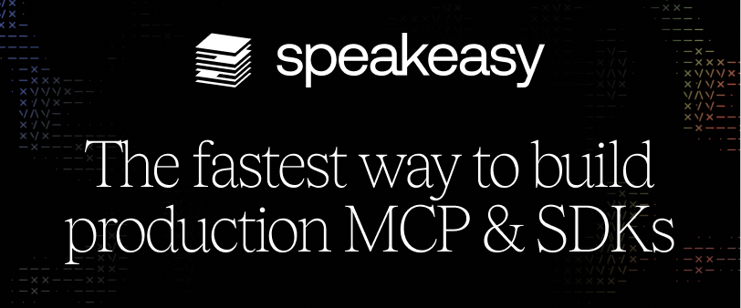

# openapi-typescript

Tools for consuming OpenAPI schemas in TypeScript.

## 📦 Packages

<a href="./packages/openapi-typescript"> 
Generate TypeScript types from static OpenAPI schemas
</a>

<a href="./packages/openapi-fetch"> 
Ultra-fast fetching for TypeScript generated automatically from your OpenAPI schema.
</a>

## ⭐ Sponsors

### 🥇 Gold Sponsors

  
  

### 🥈 Silver Sponsors

### Backers

  
  
  
  

Become a sponsor by supporting this project on [OpenCollective](https://opencollective.com/openapi-ts)!

## 🤝 Contributing

Contributions are appreciated and welcome! See the appropriate guide for each package:

- [Contributing to openapi-typescript](./packages/openapi-typescript/CONTRIBUTING.md)
- [Contributing to openapi-fetch](./packages/openapi-fetch/CONTRIBUTING.md)
- [Contributing to docs](./docs/CONTRIBUTING.md)

## ♥️ Thanks

- Thanks to [the Project Sponsors](#-sponsors) for keeping this project going!
- Thanks to [dozens of lovely, smart contributors](https://github.com/openapi-ts/openapi-typescript/graphs/contributors) that made this library possible
- Thanks to [Vitepress](https://vitepress.dev/) for the docs site
- Thanks to [Cloudflare Pages](https://pages.cloudflare.com/) for docs site hosting
- Thanks to [Algolia](https://www.algolia.com/) for the docs site search
