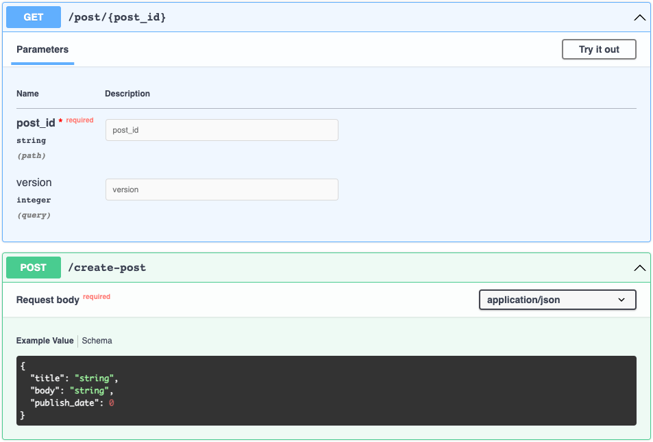

openapi-fetch is a typesafe fetch client that pulls in your OpenAPI schema. Weighs **2 kB** and has virtually zero runtime. Works with React, Vue, Svelte, or vanilla JS.

| Library                    | Size (min) | “GET” request             |
| :------------------------- | ---------: | :------------------------ |
| openapi-fetch              |     `2 kB` | `151k` ops/s (fastest)    |
| openapi-typescript-fetch   |     `4 kB` | `99k` ops/s (1.4× slower) |
| axios                      |    `32 kB` | `90k` ops/s (1.6× slower) |
| superagent                 |    `55 kB` | `42k` ops/s (3× slower)   |
| openapi-typescript-codegen |   `367 kB` | `71k` ops/s (2× slower)   |

The syntax is inspired by popular libraries like react-query or Apollo client, but without all the bells and whistles and in a 2 kB package.

```ts
import createClient from "openapi-fetch";
import { paths } from "./v1"; // generated from openapi-typescript

const { GET, PUT } = createClient<paths>({ baseUrl: "https://myapi.dev/v1/" });

const {
  data, // only present if 2XX response
  error, // only present if 4XX or 5XX response
} = await GET("/blogposts/{post_id}", {
  params: {
    path: { post_id: "123" },
  },
});

await PUT("/blogposts", {
  body: {
    title: "My New Post",
  },
});
```

`data` and `error` are typechecked and expose their shapes to Intellisence in VS Code (and any other IDE with TypeScript support). Likewise, the request `body` will also typecheck its fields, erring if any required params are missing, or if there’s a type mismatch.

`GET`, `PUT`, `POST`, etc. are only thin wrappers around the native [fetch API](https://developer.mozilla.org/en-US/docs/Web/API/Fetch_API) (which you can [swap for any call](https://openapi-ts.pages.dev/openapi-fetch/api/#create-client)).

Notice there are no generics, and no manual typing. Your endpoint’s request and response were inferred automatically. This is a huge improvement in the type safety of your endpoints because **every manual assertion could lead to a bug**! This eliminates all of the following:

- ✅ No typos in URLs or params
- ✅ All parameters, request bodies, and responses are type-checked and 100% match your schema
- ✅ No manual typing of your API
- ✅ Eliminates `any` types that hide bugs
- ✅ Also eliminates `as` type overrides that can also hide bugs
- ✅ All of this in a **2 kB** client package 🎉

## 🔧 Setup

Install this library along with [openapi-typescript](../openapi-typescript):

```bash
npm i openapi-fetch
npm i -D openapi-typescript
```

> **Highly recommended**: enable [noUncheckedIndexedAccess](https://www.typescriptlang.org/tsconfig#noUncheckedIndexedAccess) in your `tsconfig.json` ([docs](/advanced#enable-nouncheckedindexaccess-in-your-tsconfigjson))

Next, generate TypeScript types from your OpenAPI schema using openapi-typescript:

```bash
npx openapi-typescript ./path/to/api/v1.yaml -o ./src/lib/api/v1.d.ts
```

> ⚠️ Be sure to <a href="https://redocly.com/docs/cli/commands/lint/" target="_blank" rel="noopener noreferrer">validate your schemas</a>! openapi-typescript will err on invalid schemas.

Lastly, be sure to **run typechecking** in your project. This can be done by adding `tsc --noEmit` to your <a href="https://docs.npmjs.com/cli/v9/using-npm/scripts" target="_blank" rel="noopener noreferrer">npm scripts</a> like so:

```json
{
  "scripts": {
    "test:ts": "tsc --noEmit"
  }
}
```

And run `npm run test:ts` in your CI to catch type errors.

> **Tip**: use `tsc --noEmit` to check for type errors rather than relying on your linter or your build command. Nothing will typecheck as accurately as the TypeScript compiler itself.

## Usage

The best part about using openapi-fetch over oldschool codegen is no documentation needed. openapi-fetch encourages using your existing OpenAPI documentation rather than trying to find what function to import, or what parameters that function wants:



```ts
import createClient from "openapi-fetch";
import { paths } from "./v1";

const { GET, PUT } = createClient<paths>({ baseUrl: "https://myapi.dev/v1/" });

const { data, error } = await GET("/blogposts/{post_id}", {
  params: {
    path: { post_id: "my-post" },
    query: { version: 2 },
  },
});

const { data, error } = await PUT("/blogposts", {
  body: {
    title: "New Post",
    body: "<p>New post body</p>",
    publish_date: new Date("2023-03-01T12:00:00Z").getTime(),
  },
});
```

1. The HTTP method is pulled directly from `createClient()`
2. You pass in your desired `path` to `GET()`, `PUT()`, etc.
3. TypeScript takes over the rest and returns helpful errors for anything missing or invalid

## 📓 Docs

[View Docs](https://openapi-ts.pages.dev/openapi-fetch/)
